# Barebones

## Installation

### Mirrors selection

Packages are downloaded from [mirror servers](https://wiki.archlinux.org/title/Mirrors).
[Reflector](https://wiki.archlinux.org/title/Reflector) updates the mirror list by 20 most 
recently synchronized HTTPS mirrors and sorting them by download rate after connecting to the
internet on the live system.

The higher a mirror is placed on the list, the more priority it is given when downloading a package.
Usually, the one generated on the live system is fine. If not, it may be 
[edited](https://wiki.archlinux.org/title/Help:Reading#Append,_add,_create,_edit).


### Essential packages installation

[Pacstrap](https://wiki.archlinux.org/title/Pacstrap) is designed to create a new system installation from scratch.
It is used to install specified packages into a given directory after setting up the mountpoints defined before
(specifically into the root partition):

```sh
pacstrap /mnt base base-devel linux linux-firmware btrfs-progs vim intel-ucode
```

- ```base```: Minimal package set to define a basic Arch Linux installation

- ```base-devel```: Basic tools to build Arch Linux packages. It is useful to compile packages from source. More of this after
getting a solid system.

- ```linux```: [The Linux kernel](https://wiki.archlinux.org/title/Kernel) and modules. There are various [alternative 
Linux kernels](https://wiki.archlinux.org/title/Kernel#Officially_supported_kernels) available for Arch Linux in addition 
to the latest stable kernel. It is still suggested to use the vanilla one.

- ```linux-firmware```: Firmware files for Linux.

- ```btrfs-progs```: Btrfs filesystem utilities.

- ```intel-ucode```: [Microcode](https://wiki.archlinux.org/title/Microcode) update files for Intel 
CPUs. These provide bug fixes that can be critical to the stability of your system. All users with 
an AMD or Intel CPU should install the microcode updates to ensure system stability.

- ```vim```: Vi Improved, a highly configurable, improved version of the vi text editor. More of this 
program later on.

## System configuration

### Fstab

The [fstab](https://wiki.archlinux.org/title/Fstab) file can be used to define how disk partitions, various other block 
devices, or remote file systems should be mounted into the file system. A fstab file is generated with:

```sh
genfstab -U /mnt >> /mnt/etc/fstab
```

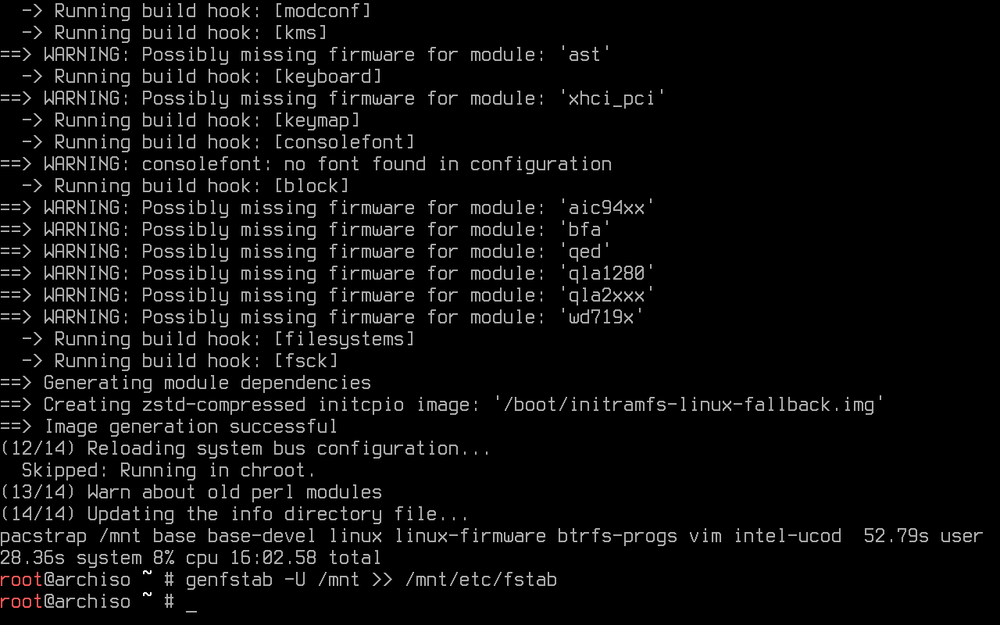

### Chroot

A [chroot](https://wiki.archlinux.org/title/Chroot) is an operation that changes the parent root directory 
for the current running process and their children. The following command changes root into the new system:

```sh
arch-chroot /mnt/
```

### TIme-zone

By running the following command, an ```/etc/localtime``` symlink that points to a zoneinfo is created. If the user's
time zone name is unknown, it is recommended to play around by looking at the zoneinfo directory content (e.g. 
```ls /usr/share/zoneinfo/```) to see which option is best suited. Replacing Region and City is necessary:

```sh
ln -sf /usr/share/zoneinfo/Region/City /etc/localtime
```

[Hwclock](https://man.archlinux.org/man/hwclock.8) is an administration tool for the time clocks. The following command
sets the Hardware Clock from the System Clock and updates the timestamps found in /etc/adjtime:

```sh
hwclock --systohc
```

### Localization

To make use of the English language in the system, ```en_US.UTF-8 UTF-8``` found in ```/etc/locale.gen``` must be uncommented:

```sh
vim /etc/locale.gen
```

By using [echo](https://man.archlinux.org/man/echo.1), it is possible to edit/create a file without having to use a text editor. 
This command creates a locale.conf file and sets the LANG variable to the same uncommented above:

```sh
echo LANG=en_US.UTF-8 > /etc/locale.conf
```

The locales are generated by running:

```sh
locale-gen
```

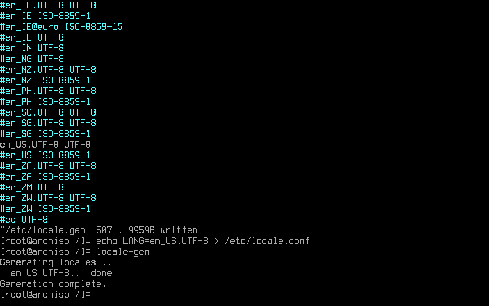

### (Optional) Persistent keyboard layout

A persistent console keyboard layout can be specified by writing it on ```/etc/vconsole.conf```. On the next
example, the Latin American layout is chosen:

```sh
echo KEYMAP=la-latin1 > /etc/vconsole.conf
```

### Network configuration

The following command creates the hostname file an adds the system's hostname. 
In this example, ```myhost``` is the hostname:

```sh
echo myhost > /etc/hostname
```

[Nss-myhostname](https://man.archlinux.org/man/nss-myhostname.8) provides localhost and the local hostname resolution to an 
IP address. Still, some software may instead read ```/etc/hosts``` directly. To prevent such software from unsafely resolving 
localhost over the network, entries for localhost are added. Resolving the local hostname is allowed by adding it too:

```sh
vim /etc/hosts
```

The following text must be added to the file:

```
127.0.0.1 localhost
::1 localhost
127.0.1.1 myhost.localdomain myhost
```

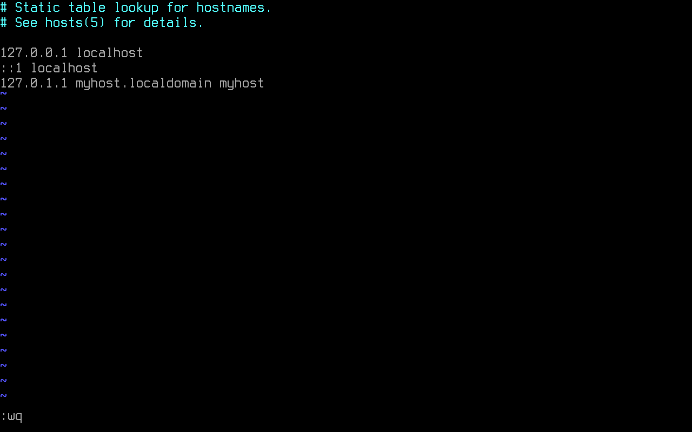

A configuration for a system with a permanent IP address or a domain name can be done too, but this won't be covered in this guide.

### Initramfs

The ```mkinitcpio.conf``` file must be edited, adding ```btrfs``` for it must be loaded before any boot hook.
Inside ```HOOKS```, ```base udev systemd autodetect keyboard modconf block sd-encrypt filesystems``` is added.

- ```base```: provides crucial runtime necessities for booting.

- ```udev```: adds the udev daemon to the initramfs, allowing for dynamic loading of modules and reliable detection of 
the root device via tags (UUID).

- ```systemd```: installs a basic systemd setup in the initramfs, and is meant to replace the ```base```, ```usr```, 
```udev``` and ```resume``` hooks. Other hooks with runtime components will need to be ported, and will not work 
as intended. Including ```base``` hook before this one to ensure that a rescue shell exists on the initramfs is a good idea.

- ```autodetect```: shrinks the initramfs to a smaller size by autodetecting the needed
modules.

- ```keyboard```: loads the necessary modules for keyboard devices.

- ```modconf```: installs modprobe configuration files from /etc/modprobe.d and
/usr/lib/modprobe.d.

- ```block```: loads the necessary modules for most block devices using pata, sata,
scsi, firewire, usb, or mmc.

- ```sd-encrypt```: allows for an encrypted root device with systemd initramfs.

- ```filesystems```: adds filesystems modules to the image.

```sh
vim /etc/mkinitcpio.conf
```

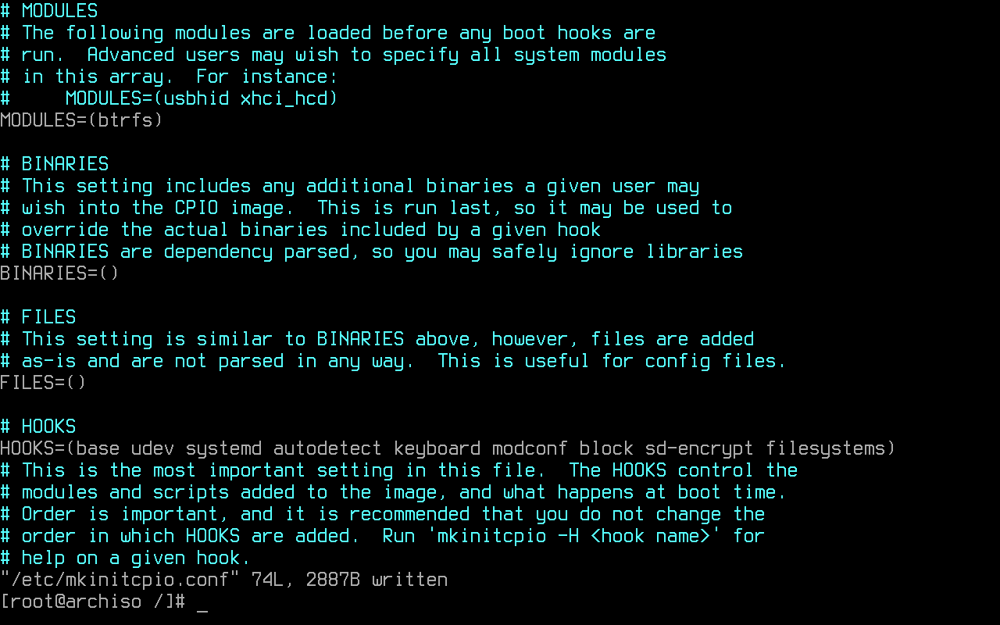

The initramfs image is recreated:

```sh
mkinitcpio -P
```

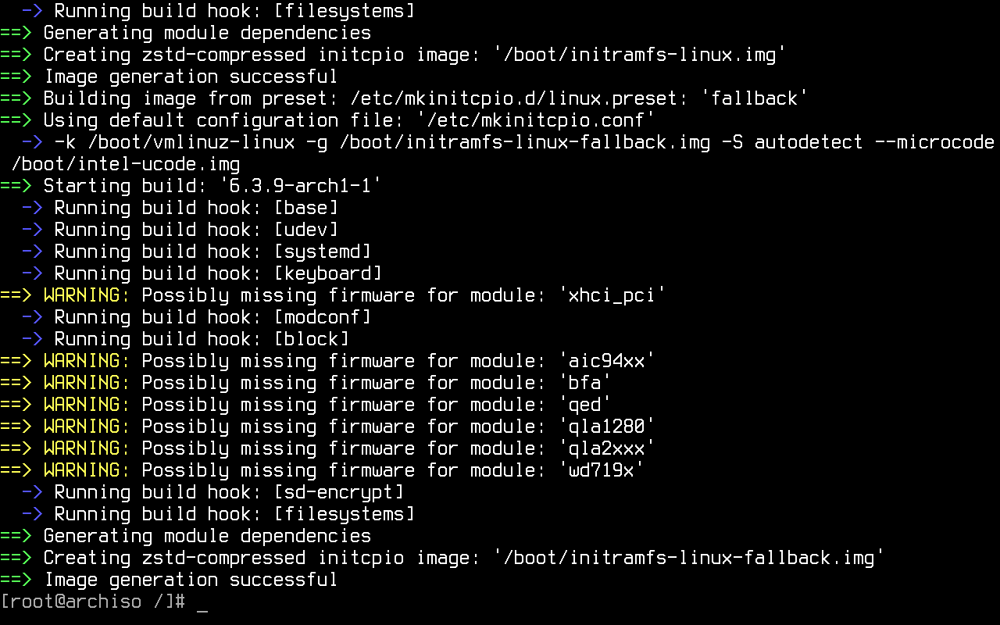

### Password creation

A root password is set:

```sh
passwd
```

### User creation

With the following command, an user and the respective home directory is created. This user is wheel member.
Wheel is the administration group, commonly used to give privileges to perform administrative actions. Even
though it isn't the default, it can also be used to give access to the [sudo](https://wiki.archlinux.org/title/Sudo) 
and [su](https://wiki.archlinux.org/title/Su) utilities. In the following example, ```username``` is the user's name:

```sh
useradd -m -G wheel username
```

The configuration for sudo is found in ```/etc/sudoers```. It must be edited by using [visudo](https://man.archlinux.org/man/visudo.8).
Visudo locks the sudoers file against multiple simultaneous edits, performs basic validity checks, and checks for syntax errors before installing the edited file. This prevents any error that could make of sudo inoperable.

The default editor for visudo is vi. To establish vim as the visudo editor for the duration of the current shell session, ```EDITOR=vim``` is written before visudo:

```sh
 EDITOR=vim visudo
```

```%wheel ALL=(ALL) ALL``` is uncommented to allow members of group wheel to execute any command:

```sh
%wheel ALL=(ALL) ALL
```

It is highly advised to set a password for the created user:

```sh
passwd username
```

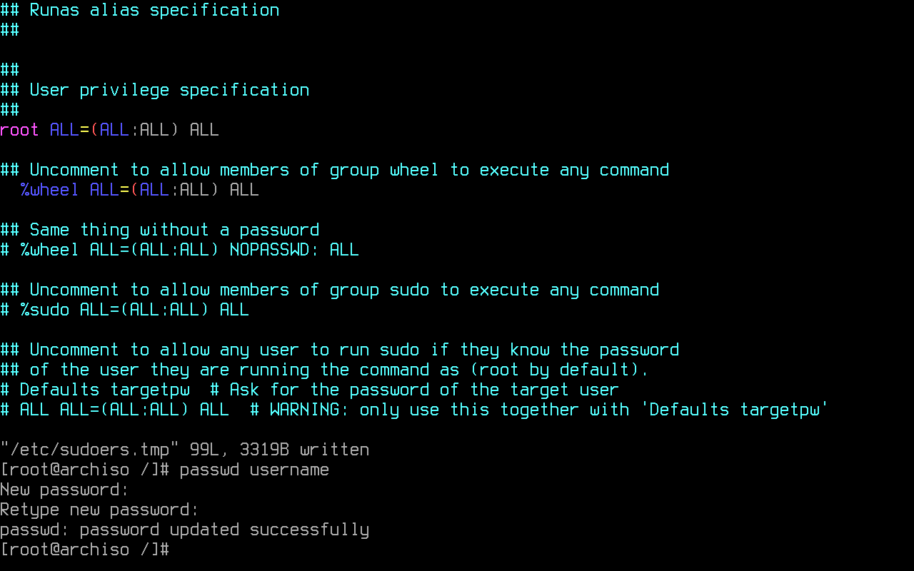

Using pacman, the following packages are installed:

- ```linux-headers```: Headers and scripts for building modules for the Linux kernel.

- ```networkmanager```: Network connection manager and user applications.

- ```dialog```: A tool to display dialog boxes from shell scripts.

- ```wpa_supplicant```: A utility providing key negotiation for WPA wireless networks.

- ```mtools```: A collection of utilities to access MS-DOS disks

- ```dosfstools```: DOS filesystem utilities.

- ```git```: The fast distributed version control system.

- ```xdg-utils```: Command line tools that assist applications with a variety of desktop integration tasks.

- ```xdg-user-dirs```: Manages user directories like ```~/Desktop``` and ```~/Music```.

```sh
pacman -S linux-headers networkmanager dialog wpa_supplicant mtools dosfstools git xdg-utils xdg-user-dirs
```

The main command used to introspect and control systemd is [systemctl](https://man.archlinux.org/man/systemctl.1). 
Some of its uses are examining the system state and managing the system and services. The following command enables
NetworkManager to start automatically at boot:

```sh
systemctl enable NetworkManager
```

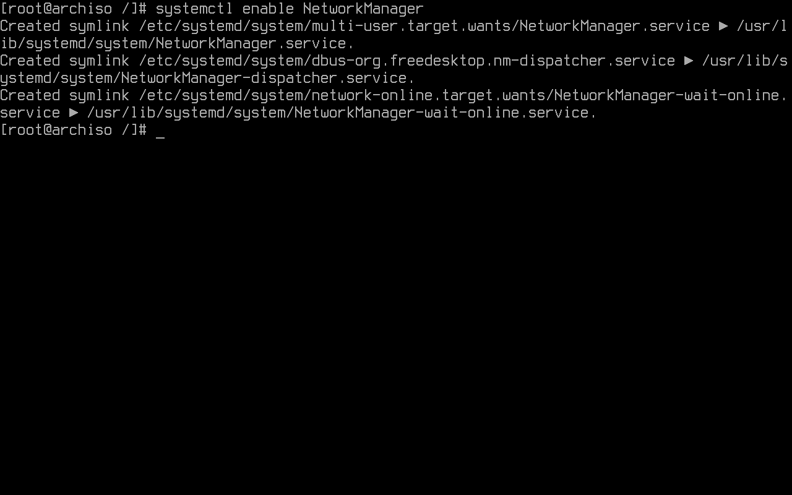

## Bootloader

### Systemd-boot as bootloader

A [bootloader](https://wiki.archlinux.org/title/Arch_boot_process#Boot_loader) is a piece of software 
started by the firmware. It is responsible for loading the kernel with the wanted kernel parameters 
and any external initramfs images.

This guide uses [Systemd-boot](https://wiki.archlinux.org/title/Systemd-boot). It is a pretty straight-forward
boot manager. It is already included with Arch's [init](https://wiki.archlinux.org/title/Init) system, 
[Systemd](https://wiki.archlinux.org/title/Systemd). 

[Bootctl](https://man.archlinux.org/man/bootctl.1) is used to install systemd-boot to the EFI 
System Partition's (ESP) mountpoint. In this case, it is mounted to ```/boot```, for separation of concerns
between OS and EFI related files is not wanted:

```sh
 bootctl --path=/boot install
```

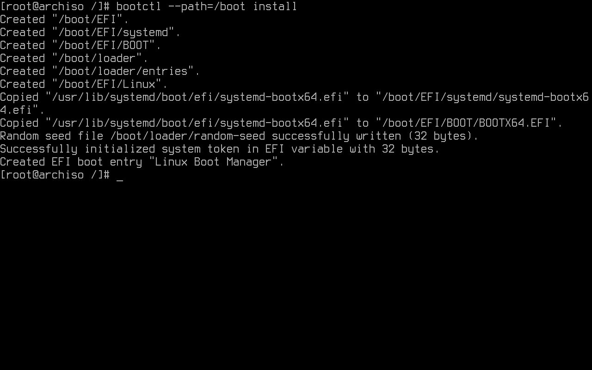

Systemd-boot searches for boot menu items. In this specific configuration, in ```/boot/loader/entries/arch.conf```.
In order to use encryption, the root's UUID (Universally unique identifier) is used to identify such partition.
It is added to the file, so it is not necessary to manually copy all of those characters:

```sh
 echo $(blkid -s UUID -o value /dev/sda2) >> /boot/loader/entries/arch.conf
```

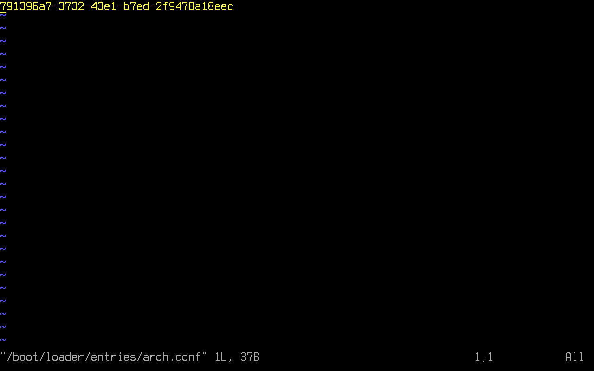

The file is then edited:

```sh
vim boot/loader/entries/arch.conf 
```

```sh
title Arch Linux
linux /vmlinuz-linux
initrd /intel-ucode.img
initrd /initramfs-linux.img
options rd.luks.name=<UUID>=crypt root=/dev/mapper/crypt rootflags=subvol=@ rd.luks.options=<UUID>=discard rw quiet
```

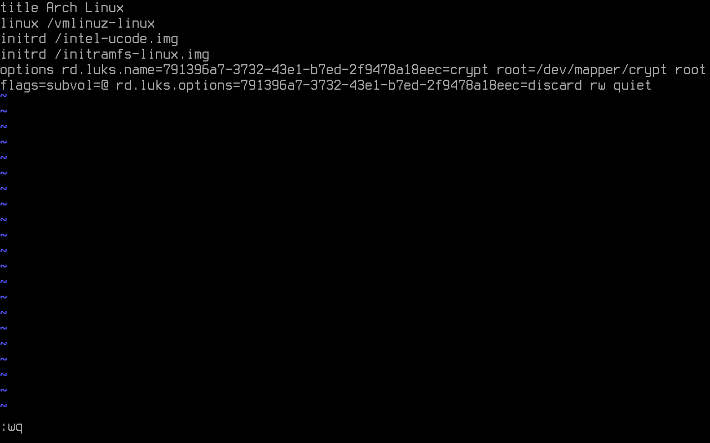

- ```title```: The Operating System name.
- ```linux```: EFI program to start. Relative to the EFI System Partition.
- ```initrd```: It is used to state kernel parameters. 
- ```options```: Options to pass to the EFI program or kernel parameters.

Since this is a linux only boot, ```linux``` can be used instead of ```efi```. The syntax differs in both cases.

The loader configurations is found in ```/boot/loader/loader.conf```:

```sh
vim /boot/loader/loader.conf
```

The following configuration is added:


## Reboot

It is required to type ```exit``` or press ```Ctrl+d``` to exit the chroot environment:

```sh
exit
```

Even though it is not a must, the used partitions may be manually unmounted.

```sh
umount -R /mnt
```

The following command restarts the machine:

```sh
reboot
```

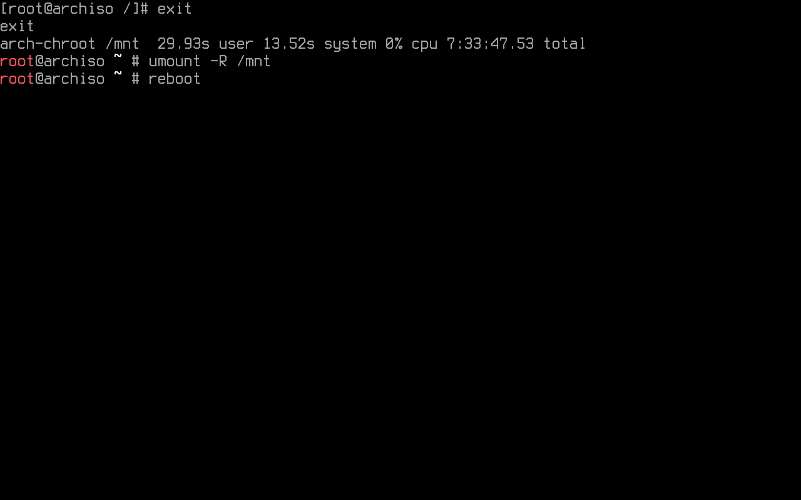