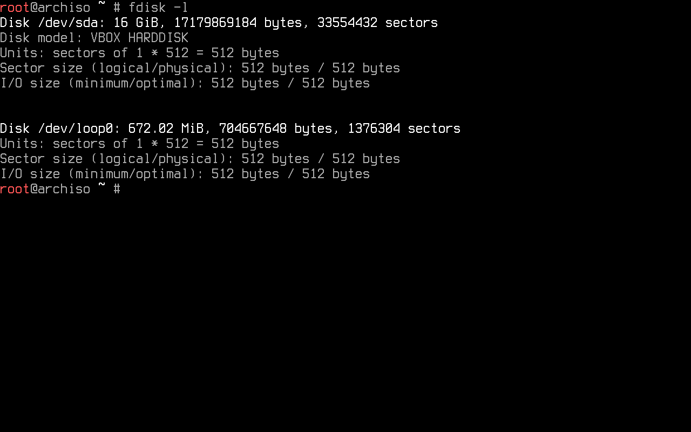

# Pre-Installation

## The very first thing

This Arch Linux install guide illustrates the process on a virtual machine. Every command and code snippet will be presented 
within code elements for easy identification and differentiation from regular text, such as this one:
```
This is a code element
```
This allows the reader to conveniently use the commands without ever reading all of these words (although 
it is not recommended).


### Installation image

To obtain an installation image, it is suggested to download an ISO file via HTTP 
from one of the mirror sites listed in the [Arch Linux HTTP Direct Downloads](https://archlinux.org/download/).
It is recommended to verify the ISO signature to make sure it is [safe to use](https://www.theregister.com/2016/02/21/linux_mint_hacked_malwareinfected_isos_linked_from_official_site/).

Once the site of choice has been selected, it greets with an index that contains the needed files. 


Downloading the ISO file and one of the checksum txt files is necessary to see if the image matches the checksum.


It does! The SHA256 checksum can also be seen on the official website.

If the reader is *extra* paranoid, the ISO PGP signature (the iso.sig file also found at the index) can be downloaded 
in the same directory and verified (assuming that [GnuPG](https://www.gnupg.org/), a libre encryption tool is already 
installed) with:

```sh
gpg --keyserver-options auto-key-retrieve --verify archlinux-version-x86_64.iso.sig
```


It is. It also matches the key fingerprint of the [Arch Linux Developer who signed the ISO](https://archlinux.org/people/developers/).


### Installation medium preparation

Archmoured assumes that the reader already knows how to prepare an installation medium and boot from a live environment.
It could be said that it is left as an exercise.

**Important**: For this specific setup, it is necessary to be booting in [UEFI mode](https://wiki.archlinux.org/title/Unified_Extensible_Firmware_Interface). If not, both disk partitioning and bootloader used in this guide are going to be 
incompatible with the reader's system.


> Protip: [Ventoy](https://www.ventoy.net) gets the most out of an installation media (most likely an USB drive). 

## Into the live environment

Once booted, a shell prompt is presented.


### (Optional) Set console font

Those small characters may not be to everyone's liking. With the aim of making the shown screenshots readable, a larger font is selected. 


Console fonts can be found in ```usr/share/kbd/consolefonts/``` and set with [setfont](https://man.archlinux.org/man/setfont.8).


### (Optional) Set console keyboard layout

The default console keymap is [US](https://en.wikipedia.org/wiki/File:KB_United_States-NoAltGr.svg). All available layouts can be found in ```/usr/share/kbd/keymaps```. For example's sake, this guide will show how to set up the [Latin American](https://commons.wikimedia.org/wiki/File:KB_Latin_American.svg) layout (la-latin1). 
To list all the available keymaps, the command ```locatectl list-keymaps``` is used. [Grep](https://www.gnu.org/software/grep/manual/html_node/index.html) comes in handy when searching for a more specific result. Searching for this specific keymap can be done with:


```sh
localectl list-keymaps | grep -i la
```

Once located, it can be set up for the current session. This is done by using [loadkeys](https://man.archlinux.org/man/loadkeys.1).
To set the already located layout, the loadkeys command followed by the chosen layout is used:

```sf
loadkeys la-latin1
```


And there it is!

### Boot mode verification

By running the following command, the boot mode is verified:

```sh
ls /sys/firmware/efi/efivars
```


Since this virtual machine has EFI enabled, it shows the directory without error (and thus is booted in UEFI mode).
If this directory does not exist on the system, the reader is strongly urged to [check again](#installation-medium-preparation) and be sure that the system is booting neither from BIOS nor CSM. 

### Internet connection

A network connection is required. An example won't be shown this time, although it is pretty [straight-forward](https://wiki.archlinux.org/title/Installation_guide#Connect_to_the_internet).

> Protip: When using Wi-Fi, the live environment offers [iwctl](https://wiki.archlinux.org/title/Iwd#iwctl).

After setting it up, the connection can be verified by [ping](https://wiki.archlinux.org/title/Network_configuration#Ping)ing 
some host. It is traditional to test a connection by tickling Google's DNS (8.8.8.8):


It stops when interrupted with ```Ctrl+c```.

### System clock configuration

In the live environment, [System-timesyncd](https://wiki.archlinux.org/title/Systemd-timesyncd) is enabled 
by default and time is synced automatically once the connection to the internet is established. By running 
[timedatectl](https://man.archlinux.org/man/timedatectl.1), it can be ensured that the system clock is accurate:

```sh
timedatectl
```

It must show an accurate [Universal Time Clock](https://time.is/UTC), that system clock is indeed synchronized, and that 
NTP service is active. If for some reason NTP is inactive, it can be enabled again by using the ```set-ntp``` command. 
It takes a boolean argument (true or false) and controls whether network time synchronization is active and enabled. If
it's true, this enables and starts the first existing network synchronization service. It is then enabled by running 
the following command: 

```sh
timedatectl set-ntp true
```

### Disk partitioning

Disks are assigned to a block device, a special file that provides buffered access to a hardware device. Using 
[fdisk](https://wiki.archlinux.org/title/Fdisk) allows to identify such devices:



This example shows that the storage device is handled by the kernel's 
[SCSI](https://wiki.archlinux.org/title/Device_file#SCSI) driver subsystem, thus it starts with ```sd```. It sorts
the devices from first to last discovered alphabetically. The device used on this guide is the ```sda`` device shown 
in the image, although it might not be the same for the reader. Results ending in rom, loop or airoot may be ignored. 

Guidance through the size of every block device
is highly encouraged (as in not partitioning that 8G device the live environment booted from when the target 
device has a 1TB HDD).

To modify partition tables, fdisk may be used.

```sh
fdisk /dev/sda
```


This setup uses an encrypted root partition and an EFI mode partition only. Usage of [swap](https://wiki.archlinux.org/title/Swap)
is left to the reader's discretion. 


> Note: From the author's perspective, it is not necessary since his machine has enough RAM for what he
has ever done and [hibernation](https://wiki.archlinux.org/title/Power_management/Suspend_and_hibernate#Hibernation) does not match 
his usercase.


A new empty [GPT](https://wiki.archlinux.org/title/Partitioning#GUID_Partition_Table) partition label (by typing ```g```) 
is created, for these partitions are expected to boot in UEFI mode. 

Adding a new partition is done by typing ```n```. To make of it the [EFI system partition](https://wiki.archlinux.org/title/EFI_system_partition), the defaults for partition number and first sector are selected. 

In the last sector, the partition's size must be specified. This one must be at least 300 MiB and no more than 1 GiB 
if multiple kernels are going to be installed (most of this later on). The author chooses to install 512 MiB, for he 
likes [powers of two](https://en.wikipedia.org/wiki/Power_of_two).

To give an example, the partition type is changed to EFI System by typing ```t``` and stating the partition type 
(```1``` for this one).


By typing ```n``` again and selecting the default option for everything, the partition table has a second partition
with the default partition type: Linux filesystem.

Even though it is not necessary, the image shows the verified partition table through ```v``` and the table itself 
with ```p```. Now it must be written to the disk and exit by typing ```w```.

In order to use luks for the created linux filesystem, an encrypted logical container must be initialized by using 
[cryptsetup](https://wiki.archlinux.org/title/Dm-crypt/Device_encryption#Cryptsetup_usage):

```sh
cryptsetup luksFormat /dev/sda2
```

This prompts the user to create a passphrase.

Via cryptsetup, the container must be opened followed by a placeholder. Any name suffices, but "crypt" is chosen 
by sheer exemplification:

```sh
cryptsetup open /dev/sda2 crypt
```

The user must enter the created passphrase.


### Partition formatting

Once the partitions have been created, both must be formatted with their 
[appropriate file system](https://wiki.archlinux.org/title/File_systems#Types_of_file_systems).

Formatting the EFI partition with FAT32 is done through:

```sh
mkfs.fat -F32 /dev/sda1
```

On the other hand, the root partition is formatted to [btrfs](https://wiki.archlinux.org/title/Btrfs).
This filesystem has been chosen for its properties, such as [compression](https://wiki.archlinux.org/title/Btrfs#Compression)
and [snapshot](https://wiki.archlinux.org/title/Btrfs#Snapshots) handling:

```sh
mkfs.btrfs /dev/mapper/crypt
```


### Partition mounting

Root and home subvolumes are created within the btrfs partition. This eases the use of snapshots since this guide
uses [timeshift](https://github.com/linuxmint/timeshift) for its convenience out of the box. To manually mount a 
file system located on a partition to a directory, [mount](https://man.archlinux.org/man/mount.8) is used: 

```sh
mount /dev/mapper/crypt /mnt

btrfs sub create /mnt/@

btrfs sub create /mnt/@home
```

The /mnt directory must be unmounted so that it can be used when mounting the partitions:

```sh
umount /mnt
```


The recently created subvolumes must be mounted.

There are several options specified:

- ```noatime```: fully disables writing file access times to the drive every time you read a file.

- ```nodiratime```: disables the writing of file access times only for directories while other files 
still get access times written.

- ```compress=zstd``` makes use of [zstd](https://man.archlinux.org/man/zstd.1.en). 

- ```space_cache``` gives control the free space cache. The free space cache greatly improves performance when 
reading block group free space into memory. Version 2 adds a new B-tree called the free space tree, addressing 
the issue that version 1 may have on large filesystems. 

- ```ssd```optimizes the process on [Solid State Drives](https://wiki.archlinux.org/title/Solid_state_drive).

```sh
mount -o noatime,nodiratime,compress=zstd:1,space_cache=v2,ssd,subvol=@ /dev/mapper/crypt /mnt
```

Using the ```--parents``` option to make parents directories as needed. It is needed for the home subvolume
and also the EFI partition.

```sh
mkdir -p /mnt/{boot,home}
```

Mounting home subvolume with the options that were given before:

```sh
mount -o noatime,nodiratime,compress=zstd:1,space_cache=v2,ssd,subvol=@home /dev/mapper/crypt /mnt/home
```

Mounting EFI partition on boot. No option is needed:

```sh
mount /dev/sda1 /mnt/boot
```

