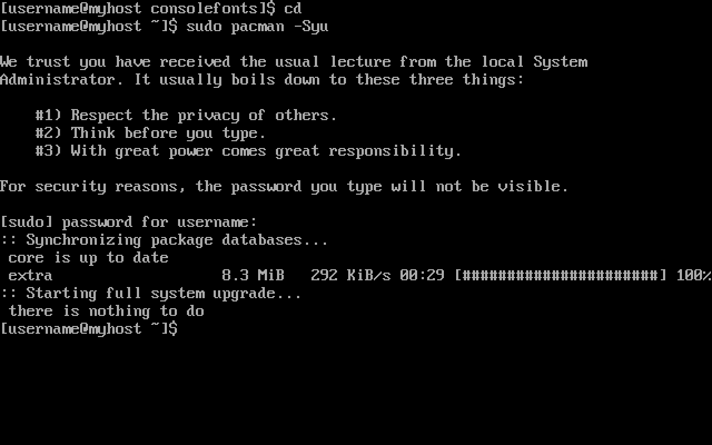
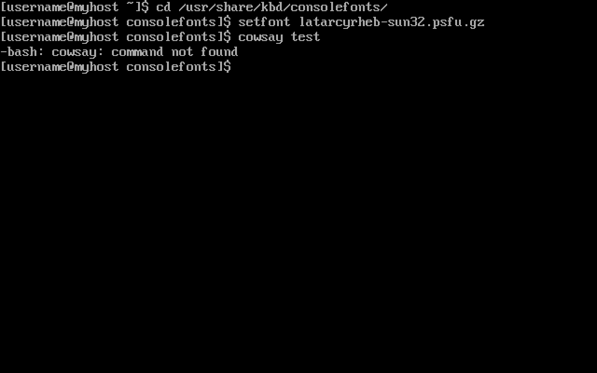

# Post-Installation

Once booted, the bootloader is displayed (if everything was done correctly).


The password created before is requested before getting into the system.


A larger font is selected.


## AUR

The [Arch User Repository (AUR)](https://wiki.archlinux.org/title/Arch_User_Repository) is a community-driven 
repository for Arch users. It contains package descriptions (PKGBUILDs) that allows users to compile a package 
from source with makepkg and then install it via pacman. Every AUR package can be found [here](https://aur.archlinux.org/)
This is why installing ```base-devel``` is important if using the AUR is planned.

[Pacman](https://wiki.archlinux.org/title/Pacman) is a package manager that is considered a huge advantage
of Arch Linux and one of its major distinguishing features. It combines a simple binary package format with 
an easy-to-use build system. All packages offered by pacman are found in the [package search](https://archlinux.org/packages/)
section.

With the purpose of having an up-to-date system, the repository databases are synchronized, and the packages are updated with:

```sh
sudo pacman -Syu
```



For convenience, an Arch User Repository helper is installed. These automate the usage of the AUR. Tasks such as package search, 
resolving of dependencies, retrieving and building, and others are automated. This guide uses [yay](https://aur.archlinux.org/packages/yay), although virtually any other helper can be used. 

Even though it is not necessary, a specific directory is selected to install this package's directory, so everything 
is neat and tidy. The following example uses the ```~/Downloads``` directory created when installing ```xdg-user-dirs```:

```sh
cd Downloads/
```

Since yay is written in [Go](https://go.dev/learn/), it is installed beforehand:

```sh
sudo pacman -S go
```

The package's git repository is cloned:

```sh
git clone https://aur.archlinux.org/yay.git
```

The directory is changed to the one containing the package's [PKGBUILD](https://wiki.archlinux.org/title/PKGBUILD):

```sh
cd yay/
```

The package is made by running ```makepkg```. The ```-i``` flag installs the package if built successfully, so it is not
necessary to do it manually:

```sh
makepkg -i
```


## Snapshots

Now that yay is installed, it is used to install timeshift:

```sh
yay -S timeshift
```

[Timeshift](https://github.com/linuxmint/timeshift) is a system restore tool. It creates filesystem 
[snapshots](https://en.wikipedia.org/wiki/Snapshot_%28computer_storage%29) using BTRFS snapshots. 

A snapshot is created to test its functionality:

```sh
sudo timeshift --create --comments "Testing..."
```

Its creation is confirmed by listing the system's snapshots:

```sh
sudo timeshift --list
```


It is. Any package is installed to test that restoration works. This example makes use of 
[cowsay](https://archlinux.org/packages/?name=cowsay):

```sh
sudo pacman -S cowsay
```


Now that the package is installed, the created snapshot is restored.

```sh
sudo timeshift --restore
```


The system is rebooted so that the snapshot becomes active.
If this recently installed package is not there anymore, it means it worked:

```sh
reboot
```

It did. Cowsay is not installed anymore. Thus, the system is finally ready.



## Graphical User Interface

There it is. A minimal installation. For desktop use, it is highly recommended using a graphical
environment. Choosing one can be a true hassle. For this, virtually any other guide suffices 
since this distro is well-known for its ricing community. For now, Archmoured encourages the 
use of [Xfce](https://wiki.archlinux.org/title/Xfce), for it brings a truly stable 
experience.